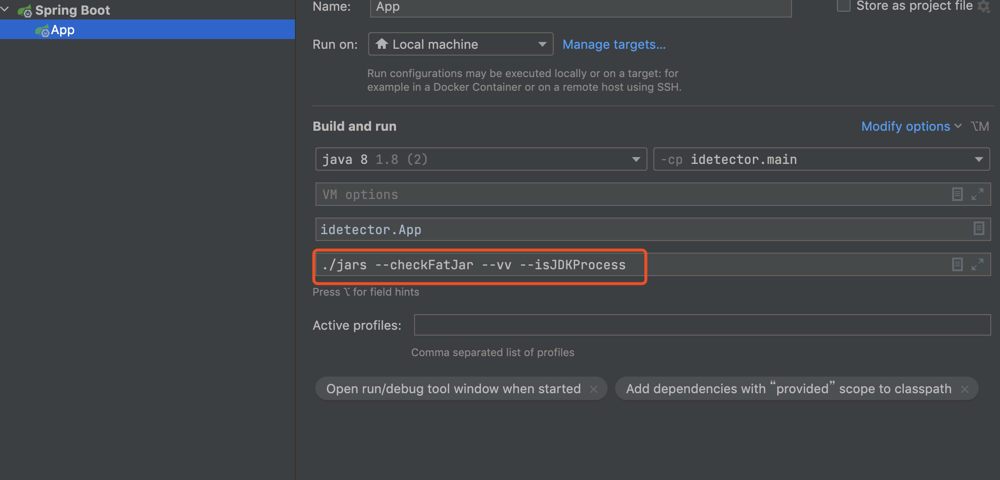

# iDetector

Step 1: Place your analysis targets within the `./jars` directory.

Step 2: Execute `App.java` using the IntelliJ IDEA development environment.

Step 3: Consult the `./results/` directory to retrieve the outcomes of your analysis.